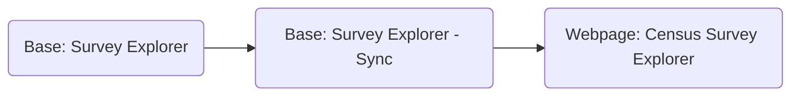

# Contributing

This project uses github to host code and accept pull requests. Pull requests and creating issues are the easiest ways to propose changes to the project. To add a pull request, use the following steps: 
1. Fork the repo and create a branch from `main`. 
2. Add code and update it with comments and documentation. 
3. Make sure that your code compiles correctly using [Parcel.js](https://github.com/parcel-bundler/parcel) in the dist folder by testing it (`parcel run index.html`) and previewing it in your localhost (i.e. [http://localhost:1234](http://localhost:1234/) ). 
4. Issue a pull request from your forked repo and wait for it to be approved!

# Structure 
The backend of this project uses the Airtable API to dynamically update the Census Survey Explorer webpages with record information from the Survey Explorer bases. 

## Backend Structure

### Base: Survey Explorer
Content writers can edit, add topics, filters, and surveys to this Airtable base freely. There are two important tabs in this base: 1) where surveys are written and 2) where the filters are witten. The Census Survey filters work by filtering through the classes of a survey card, which are written using the selected fields under a survey. 

#### Surveys
It's important to note that in this base, users should make sure to fill out all the required fields (Geography, Frequency, Topics, Subtopics, Link, Description, and Title) for each survey for it to show up in the Census Survey Explorer.

You can customize the survey descriptions within Airtable using HTML tags to add links and customize text styling. In order to do so, please use the HTML tags below as a quick guide. For more, [please go to this helpful guide.](http://www.simplehtmlguide.com/cheatsheet.php) 

|                |HTML                         |TEXT                   |
|----------------|-------------------------------|-----------------------------|
|Bolded |`'<b> Hello </b>'`            |**Hello**            |
|Italicized         |`<i> Hello </i>`            |*Hello*            |
|Links      |`<a href="https://www.census.gov/"> Hello </a>`            |[Hello](https://www.census.gov/)            |
|Line Breaks       |` `|N/A|

#### Filters
The list of filters that show up on the survey must be marked as "Yes" under the Published field and tagged with a specific type of dropdown (Subtopics, Geography, etc) in order for it to be used as a filter. 

Make sure to avoid extraneous, nonalphabetic characters to avoid any bugs with the filtering. Additionally, all filter names should be an exact match with the filters used to tag the surveys.

### Base: Survey Explorer - Sync
This project uses a synced base with a [read-only API key](https://support.airtable.com/hc/en-us/articles/360056249614-Creating-a-read-only-API-key) to import content into the Census Survey Explorer. To change the sync settings, click on the base tabs and go to the dropdown to change sync settings or sync the Airtable base. Syncing the base's content will dynamically update the information on the webpage. For more information on how to sync using Airtable, please see [this resource](https://support.airtable.com/hc/en-us/articles/360052521254-Airtable-Sync-Basic-setup). 

### Webpage: Census Survey Explorer
The webpage uses the Airtable APi with the API key from the read-only account to dynamically create filterable cards and dropdown filters to update the Home page. It runs on a responsive framework [Bootstrap](https://getbootstrap.com/) and is mobile-friendly. Using the Airtable API, the webpage syncs records and can be used to build content into web pages.
